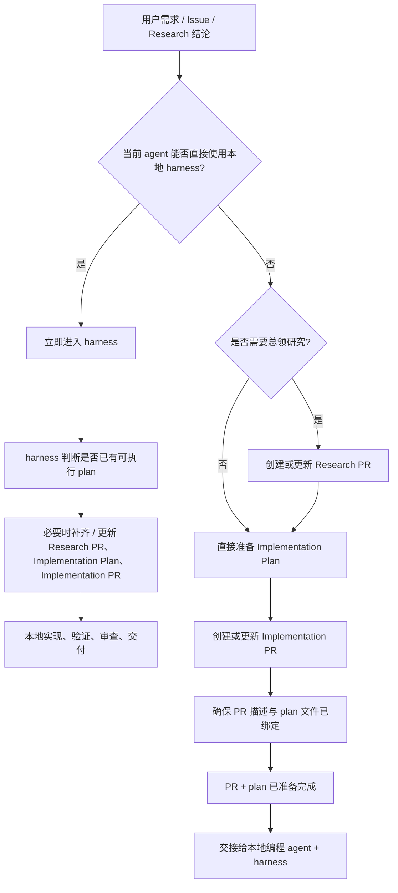

# Agent 工作流规范

## 定位

- 本项目采用任务事实优先、PR 承载交付的 agent 工作流。`docs/TASKS.md` / `docs/ROADMAP.md` / 实际文件状态用于判断项目进度和下一步；GitHub PR 是审查、交付和追踪的重要单元，但不是唯一或最高事实源。
- 本文件主要服务于不能直接进入本地 `harness` 的 agent，例如通过 GitHub connector / 云端项目接入的 agent。
- 如果你是`codex`,`claude code`或者`open code`等本地 agent，请跳过该文件。
- 如果当前环境可以直接使用本地 `harness`，实现类任务从一开始就应进入 `harness`；本文件只作为 artifact 关系、云端边界和交接规则参考。

## 必须遵循
- 当当前环境不能直接获取目录树时，必须先读取 `.oh-my-harness/tree.md` 作为目录索引。
- GitHub connector 中本项目的完整仓库名是 `liaoszong/Werewolf-agent`。
- 后续提示词如果写“连接到 {liaoszong/Werewolf-agent}”，agent 应直接使用该 `repo_full_name`，不需要再搜索 Werewolf 仓库。

## Artifact 关系

不复杂PR关系. 小任务或者清晰的多任务直接提交实现pr.而不需要研究性pr.
实现pr默认不进行过分的拆解. 单一清晰任务直接一个实现pr.多模块任务默认多个pr.
一个讨论的任务默认同时发起的pr数量不超过3个.
避免过分拆分pr

非必要不使用研究性pr.

### Research PR

Research PR 是临时研究容器。

规则：

- 默认使用 `draft`。
- 使用 `.github/PULL_REQUEST_TEMPLATE/research.md`。
- 用于研究、判断、共享边界收敛和后续 Implementation PR 拆分。
- 不合并到 `main`。不修改业务代码。
- 不在该分支上做实现开发。
- 默认新增一份研究报告文件：`docs/prs/{yyyyMMdd-HHmm}-{pr_title_snake_case}.md`；目录不存在时，在当前 PR 分支中一并创建。
- 面对简单清晰任务,请直接跳过研究性pr,直接准备实现pr。
- 非重要任务或者用户明确要求,请不要发起研究性pr。
- 当你不提交实现plan,而是让其他人进行plan时,请发起研究性pr。
- 研究性pr可作为任务转发的载体。
- 可以产出 `0-N` 个 `Implementation PR`，也可以得出“不实现”的结论。

### Implementation Plan

Implementation Plan 是实现执行协议。

规则：

- Werewolf 项目统一使用双横线路径：`docs/harness/plans/YYYY-MM-DD--<slug>-plan.md`
- 示例：`docs/harness/plans/2026-05-30--e4-runtime-demo-html-plan.md`
- 这条项目约定覆盖 `.github/writing-plan.md` 或通用模板中的单横线默认格式。
- 写 plan 前先阅读 `.github/writing-plan.md`。
- 用于承载实现步骤、测试组织和执行边界。
- 可以直接从需求生成，也可以从 Research PR 导出。
- 目录不存在时，在当前 PR 分支中一并创建。
- 每个 `Implementation PR` 必须绑定一个 `Implementation Plan`。
- “绑定”的最低标准是：
  - PR 描述中明确引用该 plan 路径；
  - plan 文件已存在于当前 PR 分支，或将随当前 PR 一起提交。

### Implementation PR

Implementation PR 是真实代码交付容器。

规则：

- 默认使用普通 PR（非 `draft`）。
- 使用 `.github/PULL_REQUEST_TEMPLATE/implementation.md`。
- 承载代码实现、验证摘要和风险摘要；不承载研究正文。
- 必须引用绑定的 `Implementation Plan`。
- 如果来自 Research PR，必须 mention 对应 Research PR。
- 创建或更新后，按 `.github/codex-review-comment.md` 准备审查评论。

### Spec PR

Spec PR 只用于更新稳定规范。

规则：

- 只在同类问题重复出现，或某条流程稳定且影响后续 agent 时创建。
- 不与业务实现混在一起。
- 优先更新相关 `AGENTS.md` 或 `docs/specs/*.md`。

## 云端能力边界

- 如果你是通过 GitHub connector / 云端项目接入或者你不支持进行 patch edit 的 agent，则不允许修改业务代码、测试代码或运行时代码。
- 这类 agent 可以创建或更新：
  - `Research PR`
  - `Implementation PR` 的标题、描述、评论和上下文
  - `Implementation Plan`
  - `docs/prs/` 下的研究报告
  - 为上述工件服务的文档型文件
- 这类 agent 可以新增或更新 Implementation Plan。
- 这类 agent 可以更新 PR title/body/comment/review comment。
- 这类 agent 可以新增为 plan / workflow 服务的文档型文件。
- 如果用户要求“不要修改代码”，仍允许创建 plan 文件；只有用户明确说“不要提交任何文件”时才禁止落盘。
- 这类 agent 在实现路径中的终点是：`PR + plan 已准备完成`。
- 如果遇到云端安全层拦截,请相同的内容重发两次,如果依然失败则切换描述表达原意.

### GitHub connector 最小读取协议

当 agent 通过 GitHub connector 生成或更新 Implementation Plan 时，必须控制工具调用次数，避免重复读取同一文件或重复检查同一路径。

推荐读取顺序：

1. 读取 `docs/specs/agent-workflow.md` 的相关行段。
2. 读取 `.github/writing-plan.md` 的相关行段。
3. 读取 `docs/TASKS.md` 中当前候选任务附近的精确行段。
4. 读取 `docs/ROADMAP.md` 中当前 phase / track 附近的精确行段。
5. 读取 `.oh-my-harness/tree.md` 一次，用于确认现有 plan 命名和文件布局。
6. 只在 plan 内容需要绑定具体实现文件时，读取相关源码 / 测试的精确行段。

禁止行为：

- 不要重复 `fetch_file` 同一个路径来确认同一个事实。
- 不要连续多次检查同一个不存在的目标 plan 文件。
- 不要为了“保险”反复读取同一份目录树、同一份 plan、同一段源码。
- 如果目标 plan 文件第一次检查返回 Not Found，应直接创建文件；不要再次检查同一路径，除非用户要求确认。
- 如果一次工具调用已经确认路径、命名或文件状态，后续回复应复用该结论。

当用户只要求 plan-only 交付时，云端 agent 不应读取大量业务源码。除非 plan 需要精确绑定实现入口，否则源码读取应限制在候选任务直接相关文件。

## 路由规则

- `Research PR` 不是必须的。
- 分析当前最应该推进的下一个开发点时，必须综合读取 `docs/TASKS.md`、`docs/ROADMAP.md`、`.oh-my-harness/tree.md`、相关源码入口和最近 PR 列表；其中 `docs/TASKS.md` 是任务进度和候选优先级的首要事实来源。
- PR 状态只能说明某项工作是否完成了 GitHub 交付 / 审查闭环，不能单独说明功能是否已经完成。
- merged PR 是已进入 `main` 的交付事实；open PR 是未收口交付上下文；未开 PR 的本地 / harness 已完成工作，需要结合 `docs/TASKS.md`、生成产物、测试结果和实际文件状态判断，不得直接视为“未完成”。
- 如果上一个 Implementation PR 仍 open，下一步默认是审查 / 收口该 PR；但如果 `docs/TASKS.md` 或用户明确说明该工作已由本地 / harness 完成而仅缺 PR，应优先准备交付归档 / PR 化，而不是重新规划同一功能。
- 如果 `docs/TASKS.md` 与 PR 历史冲突，先指出冲突并读取相关文件状态；不要只按 PR 历史下结论。
- 然后判断是否需要 Research PR。
- 若任务边界清楚，直接准备 Implementation Plan。
- 若任务边界不清楚，输出研究问题、风险点、建议拆分。
- 满足以下任一条件时，先创建或更新 `Research PR`：
  - 需要判断问题是否成立；
  - 需要共享目标表现或验收边界；
  - 需要拆分成多个 `Implementation PR`。
- 任务边界清楚、只需要一个实现单元时，可以直接准备 `Implementation Plan + Implementation PR`。

## 交接给 harness

- 当本地编程 agent 可用时，实现类任务从一开始就进入 `harness`。
- `harness` 可接手：
  - `Implementation PR`
  - `Implementation Plan`
  - 原始需求 / Issue / Research 结论 / 外部分析
- `harness` 负责判断是否已有可执行 plan，以及是否需要补齐或更新 `Research PR`、`Implementation Plan`、`Implementation PR`。
- 后续实现、验证、审查和交付由 `harness` 负责。

## 审查与交付

- 审查评论模板：`.github/codex-review-comment.md`
- 审查评论必须包含明确的 `<base_sha>..<head_sha>`。
- Research PR 如需审查，仍使用同一模板，并在背景或补充信息中明确研究性质和审查重点。
- 本地实现路径中的验证、review、merge 由 `harness` 负责；本文件不展开这些运行时细节。
- Review comment 建议固定格式：
  - `Review range: base..head`
  - `Result`
  - `What I checked`
  - `Blocking findings / Non-blocking notes`
  - `Merge recommendation`
- 如果 GitHub 拒绝 `APPROVE` 或 `REQUEST_CHANGES`，因为当前账号不能 approve / request changes 自己的 PR，则改用 `COMMENT` review。
- 不要因为 `APPROVE` / `REQUEST_CHANGES` 被拒绝就停止审查。
- `COMMENT` review 规则：
  - 有阻塞问题时，写：”不建议合并，需先修复：...”
  - 无阻塞问题时，写：”No blocking findings / OK to merge from my side.”

### Review Packet Gate v1

- Implementation PRs should provide `.logs/review/latest/review-packet.md` before Codex review.
- Codex A档 reviews only the Review Packet first.
- Without a Review Packet, the reviewer should request packet generation instead of starting full-repository review.
- A档 verdicts are limited to `PASS`, `BLOCK`, and `NEED_DEEP_REVIEW`.
- `NEED_DEEP_REVIEW` must list explicit file paths and line ranges for B档.
- Review Packet requirements are defined in `docs/specs/review-packet-gate.md`.

## Tree 与 MAP

- 新增 / 删除 / 重命名文件后，刷新 tree 的标准命令：`node .codex/hooks/tree.mjs --force`。
- 不要手工维护 `.oh-my-harness/tree.md`，除非 hook 不可用。
- 如果 hook 不可用，必须说明原因，并用等价 `git ls-files --cached --others --exclude-standard` 结果生成相同格式。
- 涉及新增 runtime 文件、测试文件、demo 文件、plan 文件时，PR 应检查 tree 是否同步。
- 不要在验证脚本中假设 `.oh-my-harness/tree.md` 或 `AGENTS.md` MAP 一定包含完整路径字符串。
- 错误示例：`"src/werewolf_eval/render_demo.py" in tree`
- 推荐写法：`"render_demo.py" in tree` 和 `"werewolf_eval" in tree`
- 也可以对命令段落检查完整命令；对 tree / MAP 检查 filename-only 或 directory-name + filename。
- 原因：tree.md 和 MAP 是树形格式，通常显示为多行目录树，不一定包含完整路径字符串。

## 事实来源

| 内容 | 事实来源 |
|---|---|
| 工程硬约束 | 根级和相关子目录 `AGENTS.md` |
| 云端桥接规则 | `docs/specs/agent-workflow.md` |
| 项目路线与阶段边界 | `docs/ROADMAP.md` |
| 任务进度、候选优先级、下一步判断 | `docs/TASKS.md` |
| 实际完成状态 | 相关源码、生成产物、测试结果、review packet / validation output |
| GitHub 交付与审查状态 | Implementation PR / Research PR / PR 评论 |
| 本地实现流程 | `harness` |
| 单次任务上下文 | 用户当前指令、Implementation Plan、PR 描述和 PR 评论 |
| 研究结论 | Research PR 描述、评论和 `docs/prs/` 研究报告；不作为长期规范 |
| 代码变更 | Git diff、Implementation PR、实际文件状态 |

## 维护边界

- 不为临时发现建立长期文档。
- 不把 Research PR 或 `docs/prs/` 研究报告视作长期规范，除非已经通过独立 Spec PR 固化。
- 不把本地 `harness` 的运行时细节复制到本文件。
- 优先保持本文件短、准、可执行。
